# Jenkins Multi-Slave on Kubernetes Pod

## Topology
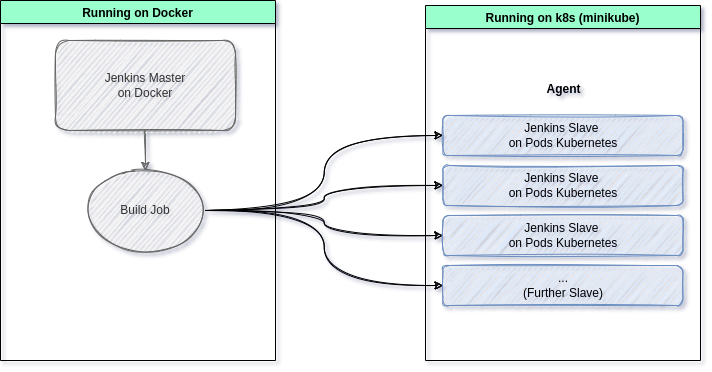

## Pre-requirement
-   Docker 
-   Minikube

## Deploy jenkins
```bash
docker run -d -p 8080:8080 -p 50000:50000 --name my-jenkins --network=host jenkins/jenkins
```
Note :
- Using network host for connect local jenkins to minikube kubernetes Control Panel

### Access on browser (http://localhost:8080) 
```bash
docker logs my-jenkins
```
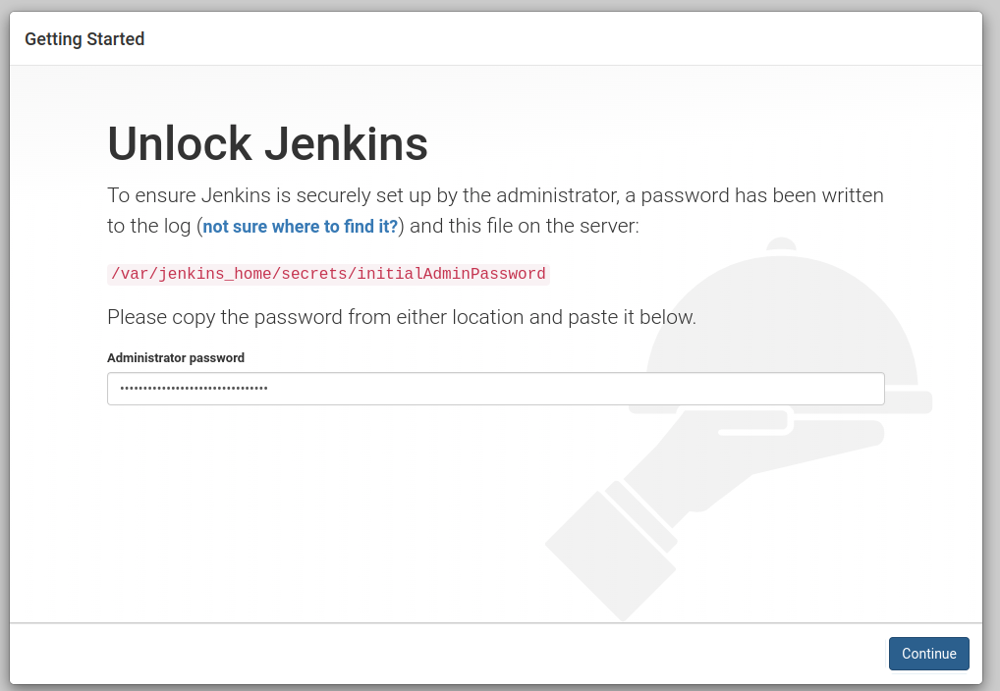

### Install suggested plugins  
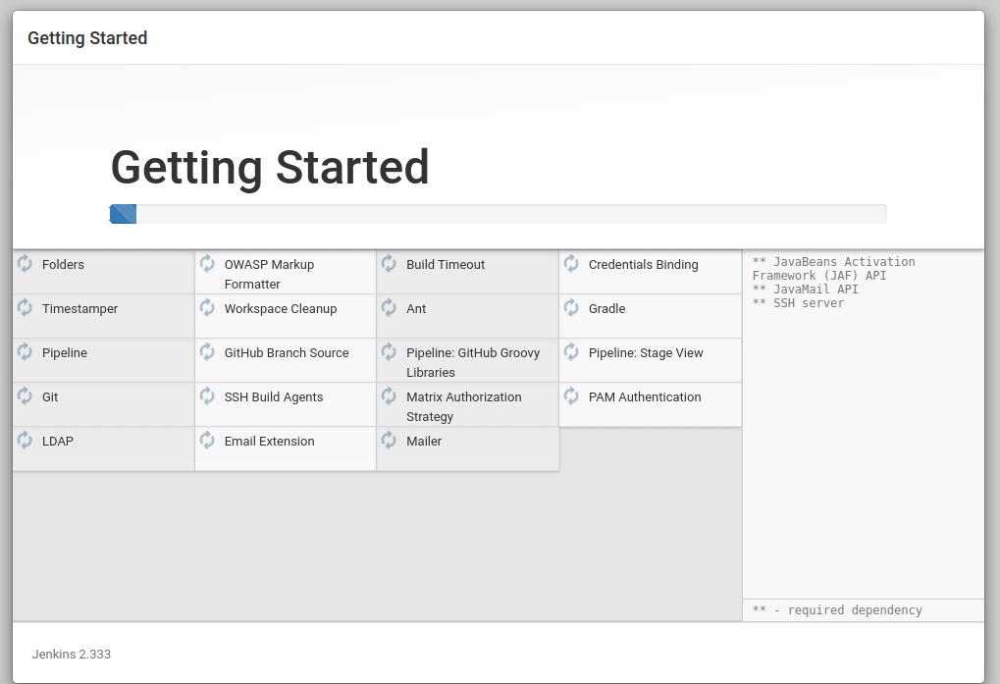

### Create user and set Jenkins URL
Create user and set Jenkins URL to `http://localhost:8080/`
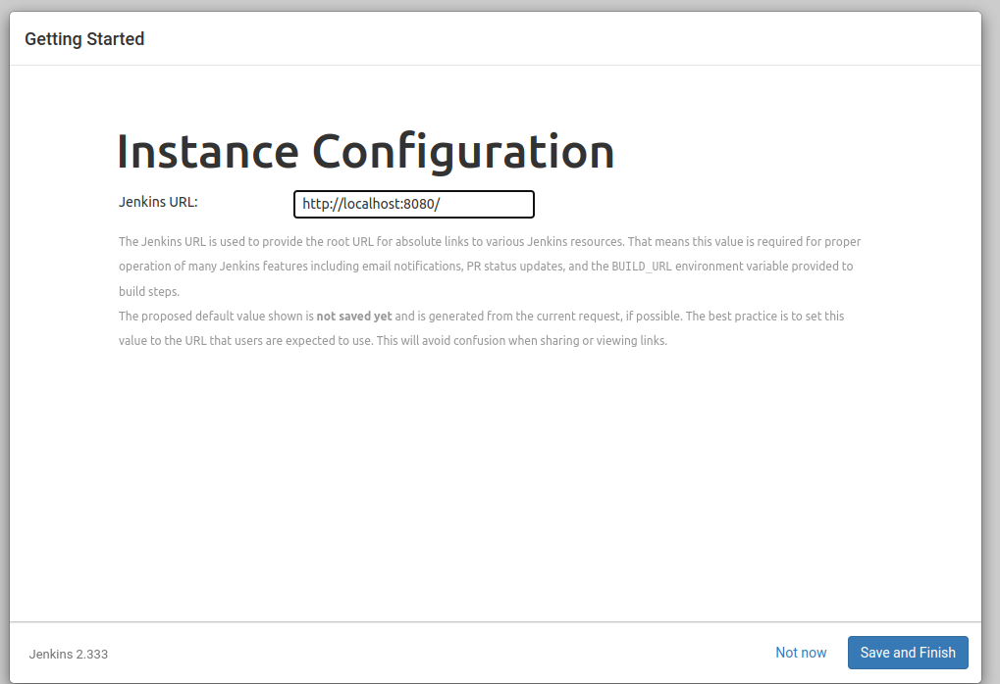
Then start using jenkins

### Dashboard Jenkins
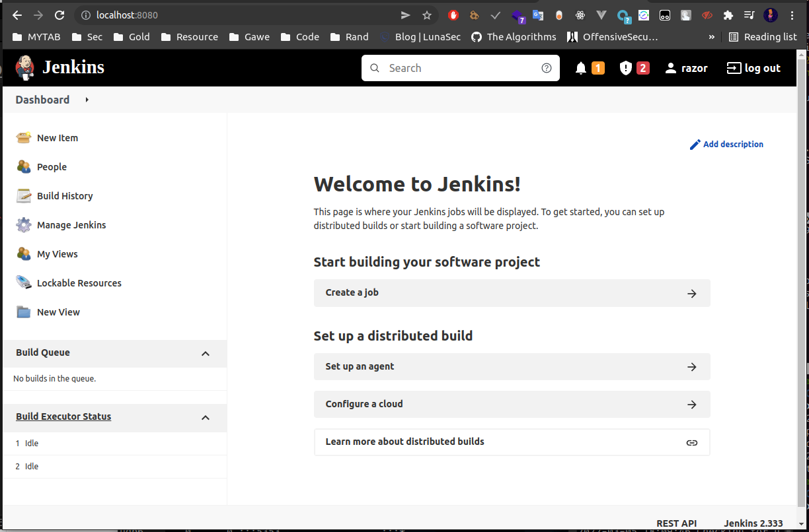


## Deploy and Configuration k8s on Minikube 
```bash
minikube start --memory=8000 --cpus=2
```
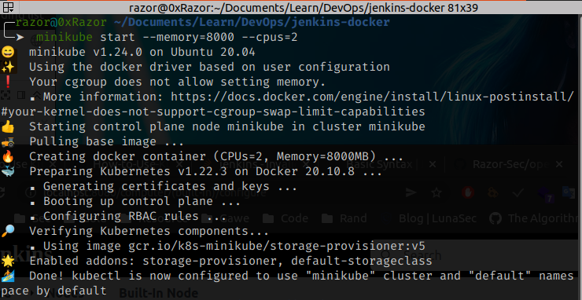

Check status
```bash
kubectl get nodes
kubectl cluster-info
```
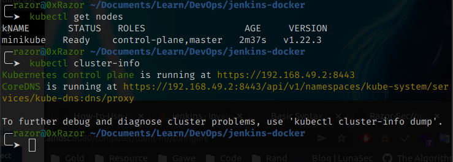

### Install dashboard (Optional) and setup Tunneling
```bash
minikube dashboard
CTRL + C
```
setup tunneling on another terminal
```bash
minikube tunnel
```

Note : 
- setup tunneling for access ClusterIP on kubernetes

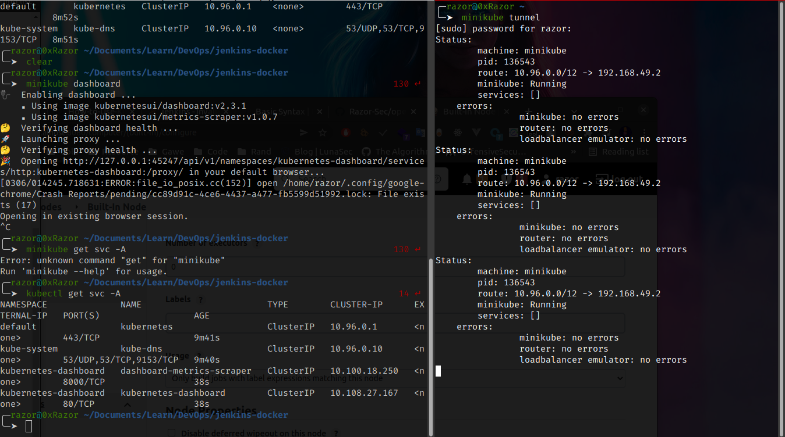

### creating namespace , serviceaccount , rolebinding for jenkins 
```bash
kubectl create namespace jenkins
kubectl get ns
kubectl create sa jenkins -n jenkins
kubectl get sa -n jenkins
kubectl create rolebinding jenkins-admin-binding --clusterrole=admin --serviceaccount=jenkins:jenkins --namespace=jenkins
kubectl get rolebinding
```
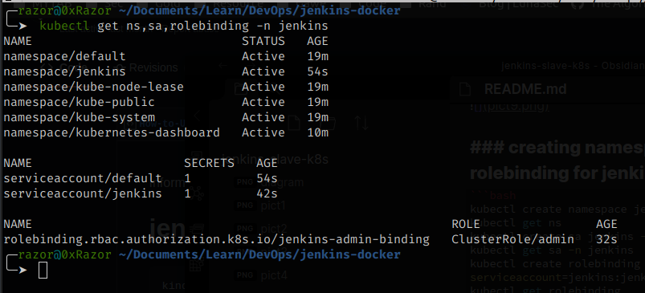

## Configuration Jenkins slave
### Disable Nodes 
Going to Manage Jenkins > Manage nodes and clouds > Built-in Node > Configure, Change to this and save
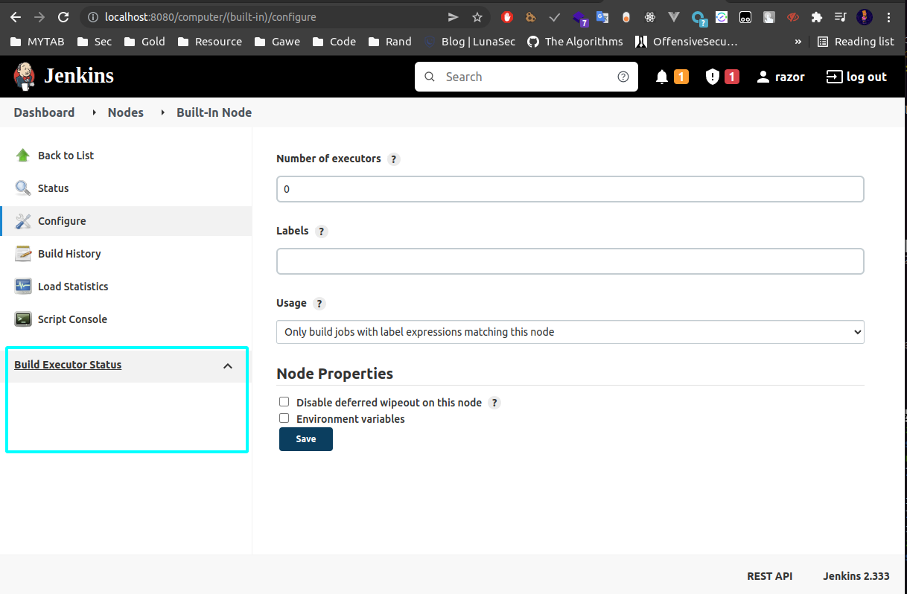
The `Build Executor Status` Should be empty

### Configuration secret
Getting secret code from service account jenkins
```bash
kubectl describe secret $(kubectl describe sa jenkins -n jenkins | grep Token | awk '{print $2}') -n jenkins
```
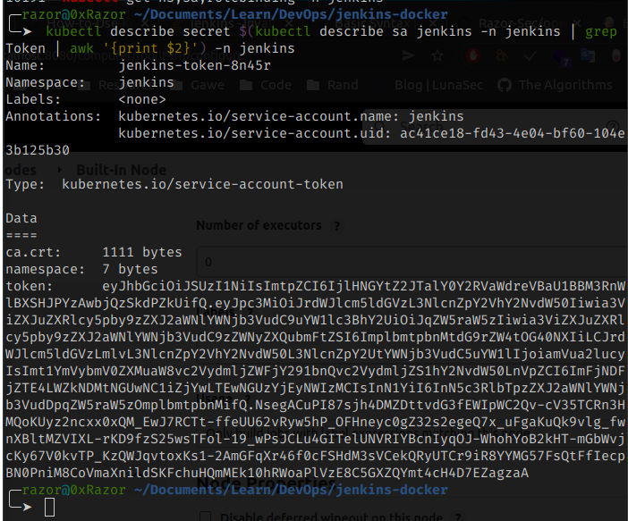
And paste to : 
Manage Jenkins > Manage Credentials > Jenkins > Glocal credentials > Add Credentials 
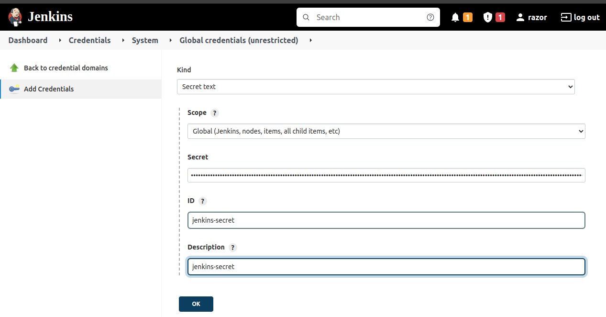

### Install kubernetes plugin on jenkins
Going to Manage Jenkins > Manage Plugins > Search Kubernetes , Then Checklist and Install without Restart , Wait until finish
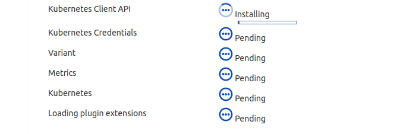

### Configuration Cloud for Kubernets Pods
Going to Manage Jenkins > Manage Nodes and Clouds > Configure Clouds > Add a new cloud (Select Kubernetes) > Kubernetes Cloud details
- Set Kubernetes URL to : https://192.168.49.2:8443 (from k8s control panel)
- Disable https certificate check
- Kubernetes Namespace : jenkins
- Credentials : jenkins-secret
Then click Test Connection
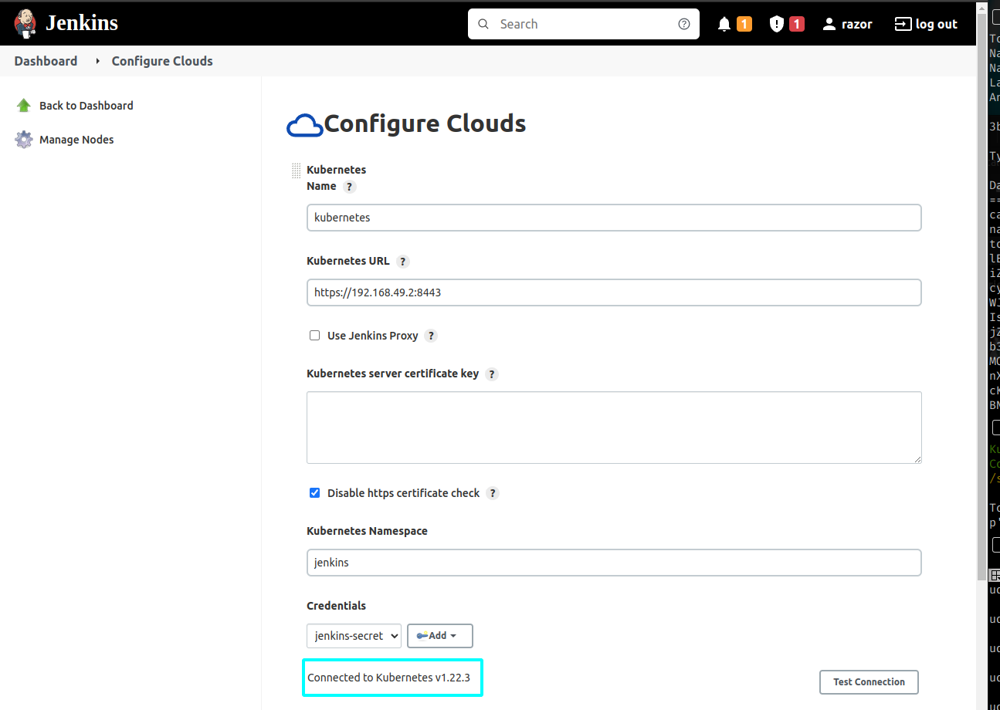
- Checklist WebSocket
- Jenkins URL : http://192.168.1.2:8080
And save
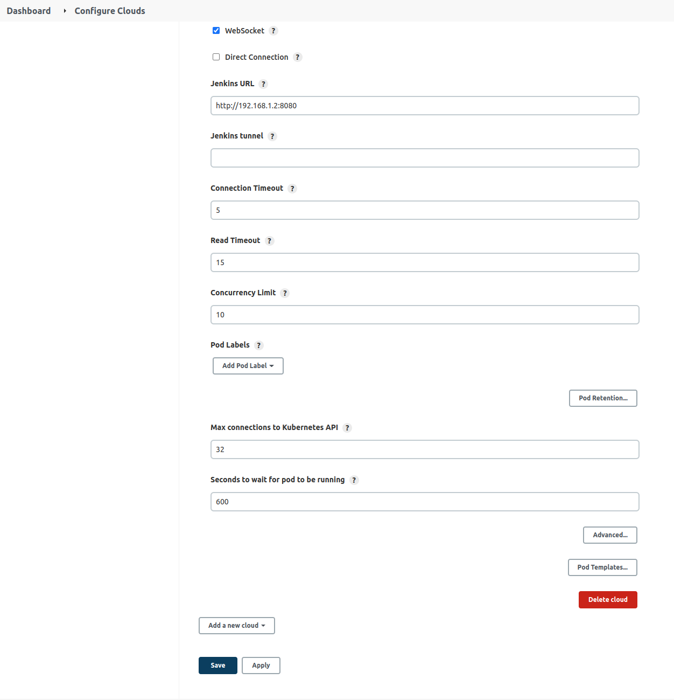

## Restart jenkins before running test pipeline
```bash
docker container stop my-jenkins
docker container start my-jenkins
```
Then going to dashboard and wait until login
## Test pipeline 1
Going to New Item > Enter project name > Select Pipeline , Then Going to Pipeline and Enter this yaml  and save 
```yaml
pipeline {
  agent {
    kubernetes {
      yaml '''
        apiVersion: v1
        kind: Pod
        spec:
          containers:
          - name: maven
            image: maven:alpine
            command:
            - cat
            tty: true
        '''
    }
  }
  stages {
    stage('Run maven') {
      steps {
        container('maven') {
          sh 'mvn -version'
        }
      }
    }
  }
}
```
Then Build now
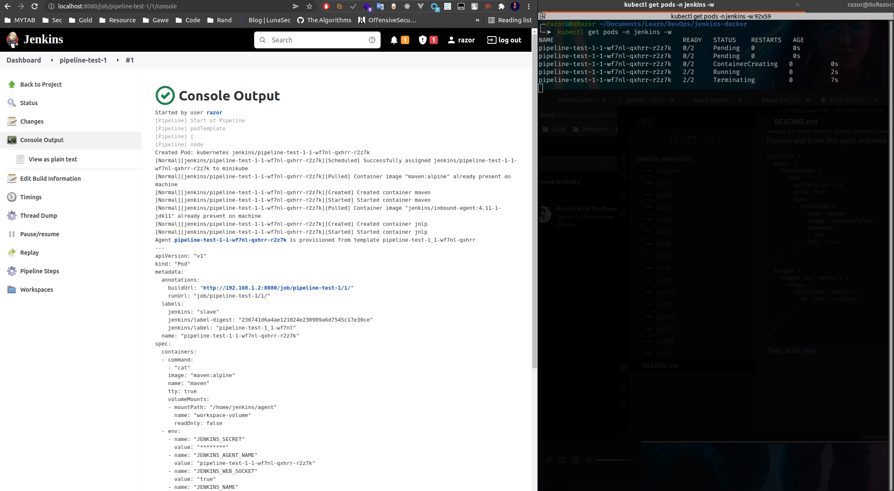

## Test pipeline 2 (Multi Container)
Going to New Item > Enter project name > Select Pipeline , Then Going to Pipeline and Enter this yaml  and save 
```yaml
pipeline {
  agent {
    kubernetes {
      yaml '''
        apiVersion: v1
        kind: Pod
        spec:
          containers:
          - name: maven
            image: maven:alpine
            command:
            - cat
            tty: true
          - name: node
            image: node:16-alpine3.12
            command:
            - cat
            tty: true
        '''
    }
  }
  stages {
    stage('Run maven') {
      steps {
        container('maven') {
          sh 'mvn -version'
          sh ' echo Hello World > hello.txt'
          sh 'ls -last'
        }
        container('node') {
          sh 'npm version'
          sh 'cat hello.txt'
          sh 'ls -last'
        }
      }
    }
  }
}
```
Then Build now
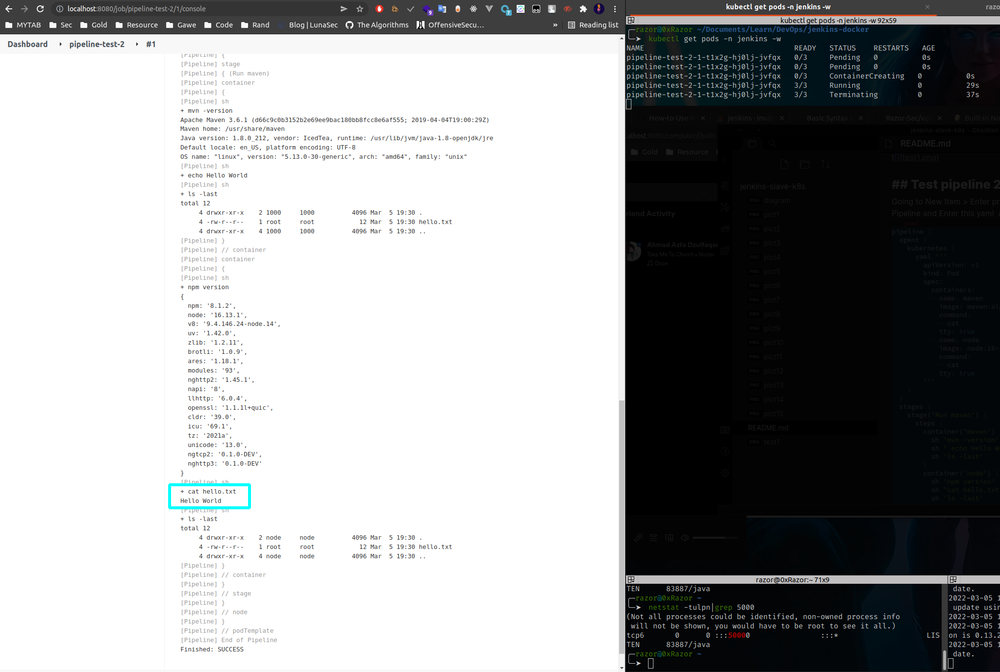

## Test build multi project
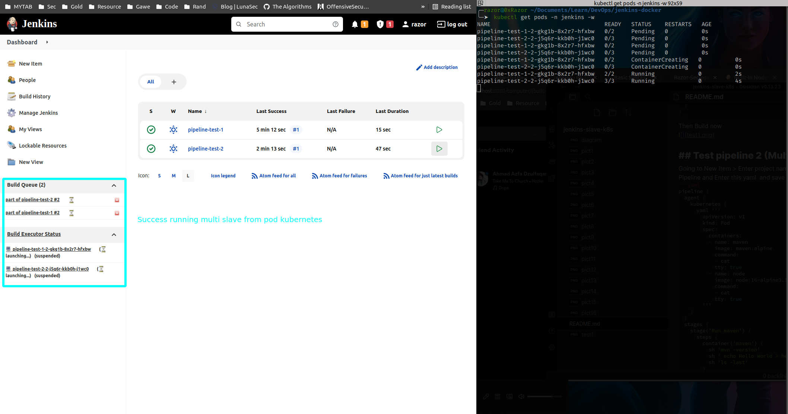

## DONE :D